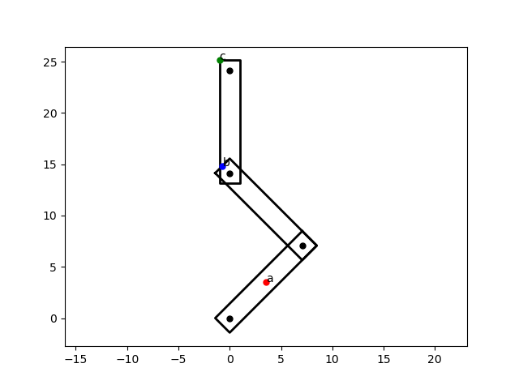

Submission by Gokul Hariharan (gokul@iastate.edu)
# Using this package
- Unzip this pack in place into ~/catkin_ws/src/
- Do a catkin_make in ~catkin_ws/src/cs576/ 

# How to run

In terminal 1, run a roscore

In terminal 2, do: 

**Note that I use cs576 and not cs476** 

    rosrun cs576 hw2_chain_configurator.py
0.7853981633974483 1.5707963267948966 -0.7853981633974483 -W 2 -L 12 -D 10

In terminal 3, do

    rosrun cs576 listener.py

You should see an output like:

    [INFO] [1677168692.973365]: /listener_6420_1677168692762 config = [0.7853981852531433 1.5707963705062866 -0.7853981852531433]
    [INFO] [1677168692.977140]: /listener_6420_1677168692762 W = 2.0
    [INFO] [1677168692.979546]: /listener_6420_1677168692762 D = 10.0
    [INFO] [1677168692.981390]: /listener_6420_1677168692762 L = 12.0

In terminal 4, type:

    rosrun cs576 hw2_chain_plotter.py

You should see an output like this:

    (0.7853981852531433, 1.5707963705062866, -0.7853981852531433)
    Extra credit, question, for v = (0,14), this is the set: 
    {1, 2}
    a:  (3.535533828661186, 3.535533983204288)
    b:  (-0.7071074457218689, 14.849242049468346)
    c:  (-1.000001098997681, 25.14213527093333)

and this plot:

